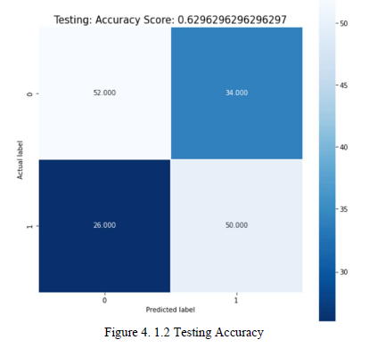

# TRAVELLING PREFERENCES AMONG MALAYSIAN CITIZENS

This project presents a machine-learning-based travelling preferences
recommendation system that guides and recommends travelling preferences to travellers. The system is designed
to help travellers identify and plan their next vacation by suggesting destinations that match their individual
preferences. The recommendation system is trained on a large dataset of past traveller preferences and destination
information, which allows it to make accurate and personalized recommendations.

The scope includes the visualization of travelling preferences among Malaysian citizens. The platform
that used is Jupyter Notebook. The data is retrieved from a survey created by using Google Form. Data
preparation activities such as data cleaning, data transformation, data reduction, and data discretization
was performed. The classification algorithm that used in the system is the K-Nearest Neighbor algorithm.

## Roadmap

- Data Preparation

- Data Cleaning/Explore

- Data Transformation

- Develop/Train Model

- Evaluate Model

- Data Testing

## Documentation

For the documentation of this project, you can check it over [here](https://pdf.ac/1zCCBz).

## Screenshots

- Training Accuracy Percentage: 77.26%

- Testing Accuracy Percentage: 62.96%
  

## Lessons Learned

- The results of this project can be used to provide travelers with personalized recommendations for their next vacation, which can improve their overall experience and satisfaction.
- The project employed a comprehensive data science process, including data preparation, analysis, cleaning, transformation, modeling, and testing.

